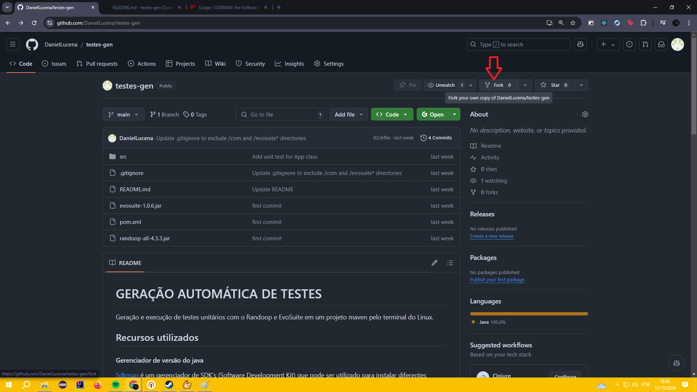
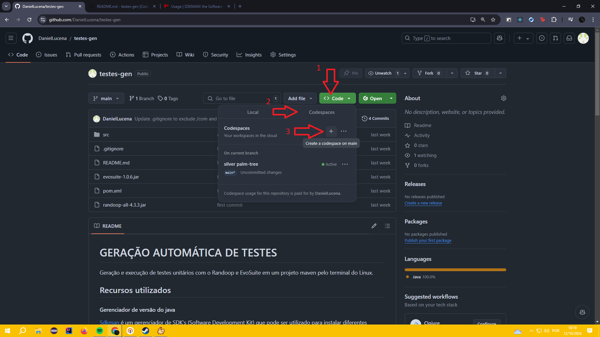
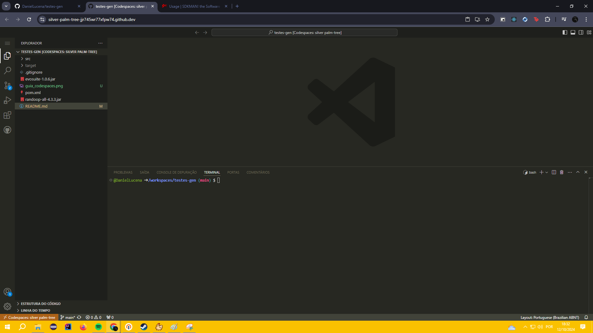

# GERAÇÃO AUTOMÁTICA DE TESTES

Geração e execução de testes unitários com o Randoop e EvoSuite em um projeto maven pelo terminal do Linux.

## Rodando remotamente com o Github Codespaces
O GitHub Codespaces é um ambiente de desenvolvimento instantâneo e baseado na nuvem que usa um contêiner para fornecer linguagens, ferramentas e utilitários de desenvolvimento comuns. Ele é gratuito e oferece um terminal linux com uma serie de pacotes utilitario já pré-instalados, como o Sdkman que vamos usar para mudar a versão do java e do maven no nosso ambiente de desenvolvimento. 

### Faça um fork deste repositório!
Antes de prosseguir faça um fork desse repositório na sua conta, para que você consiga fazer os commits das suas alterações e futuramente possa baixar o repositório p fazer o envio da atividade.


Para fazer o fork deste repositório, usando o seu navegador vá para a raiz do repositorio remoto. Clique em <b>"Fork"</b>, quando você for redirecionado para outra pagina clique em <b>"Create Fork"</b>




### Criando um novo Cdespace
No seu navegador vá para a raiz do repositorio remoto navegue pelos seguintes menus CODE > Codespaces > Create a codespace on main.



<br>

Se tudo der certo você irá se deparar com um editor de codigo similar ao VS Code no seu navegador como na imagem abaixo.



### Configurando o ambiente
Com o codespace criado vamos configurar a versão do java e do maven.

#### Mudando a versão do java para 8
``` bash
sdk install java 8.0.422-tem
```

#### Definindo o java 8.0.422-tem como o padrão
``` bash 
sdk default java 8.0.422-tem
``` 

#### Mudando a versão do Maven para
``` bash
sdk install maven 3.6.3
```

#### Definindo o maven 3.6.3 como o padrão
``` bash 

sdk default maven 3.6.3
``` 

Agora você está com um ambiante no codespaces configurado para poder continuar seguindo passo a passo para gerar e executar testes unitario com o Randoop e EvoSuite. Pode pular a criação do projeto maven e ir direto para <a href="#randoop">Rodando o Randoop</a> ou para <a href="#evosuite">Rodando o EvoSuite</a>.
<br>

## Recursos utilizados

#### Gerenciador de versão do java

[Sdkman](https://sdkman.io/) é um gerenciador de SDK's (Software Development Kit) que pode ser utilizado para instalar diferentes versões do Java e trocar facilmente de uma versão para a outra.
<br>Similar ao NVM para Node.
<br>versão do Java que utilizei: 8.0.422-tem

## Criação do projeto Maven

Recomendo criar um projeto com o Java 8, para não precisar mudar de versão para executar o Randoop e o EvoSuit. Além disso tive algumas dificuldades para gerar testes para pacotes com recursos de versões mais atuais do Java como Records por exemplo.

#### versão do Maven utilizada

```bash
$ mvn -version
Apache Maven 3.6.3
```

#### Criar projeto Maven simples com o mínimo necessário

```bash
mvn archetype:generate -DgroupId=com.example -DartifactId=demo -DarchetypeArtifactId=maven-archetype-quickstart -DarchetypeVersion=1.0 -DinteractiveMode=false
```

#### Copiar arquivos necessários

Copie o [pom.xml](./pom.xml) desse projeto, alterando de acordo com o seu projeto os atributos de groupId, artifactId e name.
<br>
Copie os arquivos .jar [evosuite-1.0.6.jar](./evosuite-1.0.6.jar) e [randoop-all-4.3.3.jar](./randoop-all-4.3.3.jar) para a raiz do seu projeto.

#### Atualizar dependencias do maven

```bash
mvn install
```

<h2 id="randoop">Rodando o Randoop</h2>

#### Compilar e empacotar o projeto

```bash
mvn clean package
```

#### Gerar testes com o Randoop para uma classe

```bash
java -Xmx3000m -classpath ./randoop-all-4.3.3.jar:./target/classes randoop.main.Main gentests --testclass=com.example.Conta --output-limit=100 --junit-output-dir=./src/test/java --junit-package-name=com.example
```

#### Gerar testes com o Randoop para um pacote

```bash
java -Xmx3000m -classpath ./randoop-all-4.3.3.jar:./target/classes randoop.main.Main gentests --test-package=com.example --output-limit=100 --junit-output-dir=./src/test/java --junit-package-name=com.example
```

#### Executar testes gerados

```bash
mvn test
```

#### Consultar documentação para adicionar novas flags

https://randoop.github.io/randoop/manual/index.html#command-line-options

<h2 id="evosuite">Rodando o EvoSuite</h2>

#### Compilar e empacotar o projeto

```bash
mvn clean package
```

#### Gerar testes com o EvoSuite para uma classe

```bash
java -jar ./evosuite-1.0.6.jar -class com.example.Conta -projectCP ./target/classes
```

#### Gerar testes com o EvoSuite para um pacote

```bash
java -jar ./evosuite-1.0.6.jar -prefix com.example -projectCP ./target/classes
```

#### Copiar testes gerados para diretório de testes do projeto

```bash
find ./evosuite-tests/com/example -type f -name "*.java" -exec cp {} ./src/test/java/com/example/ \;
```

#### Executar testes gerados

```bash
mvn test
```
